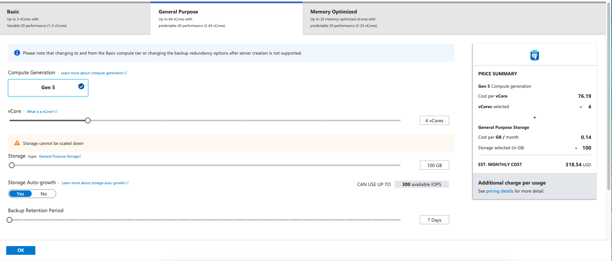

# Setting up Azure 

This repo contains notes and guidance on setting up Azure for use in a big data class. These notes are primarily to help me remember the process and are not necessarily correct.  I was going through the process as a university entity, which does make some elements different.

## Buying time

You can choose to buy [Azure time directly](https://azure.microsoft.com/en-us/pricing/purchase-options/) or go through a reseller.  Our university has a relationship with [SHI](https://www.shi.com/), and I elected to use SHI to purchase time on Azure. When you go through SHI, it looks like you have to figure out some settings on [enterprise agreement portal](https://ea.azure.com/) before your portal.azure.com will be connected.  After 15 minutes with two Microsoft employees, we got that working.  I wish I remembered the details.

There were options to pre-purchase time with a one-year or three-year expiration.  The time chunks were sold in ~3k units.   

## Navigating portal.azure.com

Once in [portal.azure.com](https://portal.azure.com/#home), you will need to complete the following steps.

1. Connect your subscription
2. Create a resource group using that subscription ([What is a resource group?](https://www.otava.com/reference/how-to-use-azure-resource-groups-a-simple-explanation/))
3. Within that resource group, add a resource (e.g., Databricks, PostgreSQL, storage) or functionality from the Azure Marketplace by clicking the `+ add` link.

4. For our big data class, we use `Azure Databricks`, `Azure Database for PostgreSQL`, and the Microsoft `Storage account` resources. You will need to go to each and then `Create` the resource.  When you create each resource, you will need to pick a region.  The region names change a little at almost every drop-down, so be careful.
    1. `Azure Databricks`: I accepted the defaults.  You will build your spark clusters in Databricks.
    2. `Azure Database for PostgreSQL`: This element has a revolving cost that can be relatively high.  The minimum price for one CPU with 100 GB of storage is ~$40 a month (see steps below for this resource).
    3. `Storage account`:

### Azure Database for PostgreSQL

1. Click the `Create` button.

2. You will then want to select `single server` to get the lowest monthly cost.

3. Now, you will be able to set up the server.  Make sure you pick the same _Location_ as your other resources. You will want to click on `configure server`

4. You will then see the `General Purpose` tab.  Click on the `Basic` tab.

5. On the `Basic` tab, you can adjust to one core and reduce the store to the size you require.  My database is about 30 gigs. Then click `ok`.

6. Now, you can go through the additional steps and then click `Create` at the bottom.
