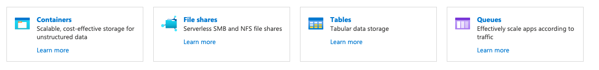
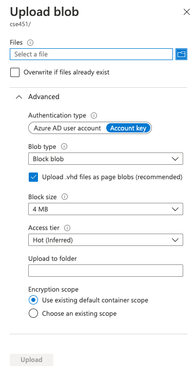

# Setting up the `Storage account` resource

1. Click on `+ Container` to create a container once you are in the `Storage account` service.  You can name the container on the right and then click `Create`. Containers are like directories or folders on your computer.

2. Within the container you can click on `^Upload` to move files from your computer to the storage resource. A side window will pop up titled __Upload blob__.  You can think of a blob as a file.

3. Click the `Advanced` to show the advanced options.

4. I use the default settings. You can choose to _create a folder_ whithin which the files will be uploaded using the `Upload to folder` box.
5. Then use the `Select a file` box to choose which files you would like to upload.

### References

- [Introduction to the core Azure Storage services](https://docs.microsoft.com/en-us/azure/storage/common/storage-introduction)
- [Introduction to Azure Blob storage](https://docs.microsoft.com/en-us/azure/storage/blobs/storage-blobs-introduction)
